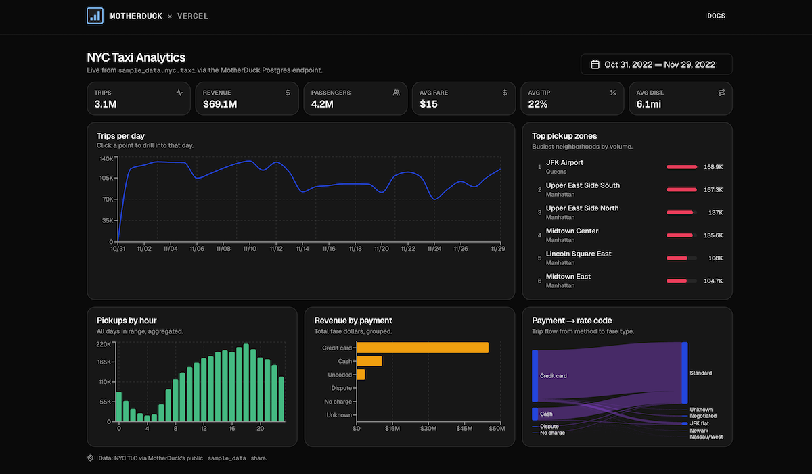

# Next.js + MotherDuck Postgres endpoint quickstart

An interactive NYC Taxi analytics dashboard built on [Next.js](https://nextjs.org) App Router, querying [MotherDuck](https://motherduck.com) over the [Postgres endpoint](https://motherduck.com/docs/key-tasks/authenticating-and-connecting-to-motherduck/postgres-endpoint) with the standard [`pg`](https://www.npmjs.com/package/pg) driver.

The template queries MotherDuck's public `sample_data.nyc.taxi` share, so you get a working dashboard the moment you deploy.



## Deploy

[](https://vercel.com/new/clone?repository-url=https%3A%2F%2Fgithub.com%2Fmotherduckdb%2Fnextjs-motherduck-pg-quickstart&env=MOTHERDUCK_HOST&envDefaults=%7B%22MOTHERDUCK_HOST%22%3A%22pg.us-east-1-aws.motherduck.com%22%7D&envDescription=Motherduck%20Postgres%20endpoint%20URL%20for%20the%20region%20you%20signed%20up%20for&envLink=https%3A%2F%2Fapp.motherduck.com%2Fsettings%2Fpostgres&project-name=nextjs-motherduck-pg-quickstart&repository-name=nextjs-motherduck-pg-quickstart&integration-ids=oac_sO4uodPhwGAmXv89UHYLiDui&skippable-integrations=1&products=%5B%7B%22type%22%3A%22integration%22%2C%22integrationSlug%22%3A%22motherduck%22%2C%22productSlug%22%3A%22motherduck%22%2C%22protocol%22%3A%22storage%22%2C%22group%22%3A%22analytics%22%7D%5D)

Or install the [MotherDuck Native Integration](https://vercel.com/marketplace/motherduck) from the Vercel Marketplace — it provisions a database and sets the required environment variables for you.

## What's inside

- **App Router** home page (`src/app/page.tsx`) that server-renders the usable date bounds, then hands off to a client dashboard.
- **`src/app/api/dashboard/route.ts`** — fans out six parameterized aggregate queries in parallel (KPIs, trips-per-day, pickups-by-hour, revenue-by-payment-type, payment→rate Sankey, top pickup zones) for a given `start`/`end` range.
- **`src/app/api/bounds/route.ts`** — returns the min/max days with meaningful trip volume so the date picker stays on well-populated data.
- **`src/lib/motherduck.ts`** — a shared `pg.Pool` registered with [`attachDatabasePool`](https://vercel.com/docs/functions/reusing-connections) from `@vercel/functions`, so connections survive and shut down cleanly across warm invocations on Fluid Compute.
- **`src/components/dashboard.tsx`** — client dashboard with KPI cards, Recharts line/bar/Sankey charts, click-to-drill day view, and a bounded date-range picker.
- **shadcn/ui** components (`button`, `card`, `calendar`, `date-range-picker`, `popover`, `separator`, `skeleton`), **Tailwind CSS v4**, **Geist** fonts, dark mode by default.

## Prerequisites

- Node.js 20 or later
- A MotherDuck account — free tier works. Sign up at [app.motherduck.com](https://app.motherduck.com).

## Getting started

```bash
# 1. Clone and install
git clone https://github.com/motherduckdb/nextjs-motherduck-pg-quickstart.git
cd nextjs-motherduck-pg-quickstart
npm install

# 2. Configure your MotherDuck token
cp .env.example .env.local
# then edit .env.local and paste your token from
# https://app.motherduck.com/settings/tokens

# 3. Run the dev server
npm run dev
```

Open [http://localhost:3000](http://localhost:3000) — the dashboard auto-loads the full date range from `sample_data.nyc.taxi`. Click any point on the trips-per-day line to drill into a single day.

## How it works

The Postgres endpoint lets MotherDuck speak the Postgres wire protocol, so any Postgres client — including `pg` on a Vercel Function — can run full DuckDB SQL against it. This template wires up a pooled connection once and shares it across requests:

```ts
// src/lib/motherduck.ts
const pool = new Pool({
  connectionString: `postgresql://user:${token}@${host}:5432/${DATABASE}`,
  ssl: { rejectUnauthorized: true },
  max: 10,
  idleTimeoutMillis: 5000,
});

attachDatabasePool(pool); // graceful shutdown on Fluid Compute
```

Route handlers borrow a client from the pool, run parameterized queries in parallel with `Promise.all`, and return JSON. No ORMs, no code generation, no cold-start cost beyond the first Postgres handshake.

## Environment variables

See [`.env.example`](./.env.example) for the full list with inline documentation.

| Variable | Required | Description |
| --- | --- | --- |
| `MOTHERDUCK_TOKEN` | yes | Your MotherDuck access token (JWT). |
| `MOTHERDUCK_HOST`  | no  | MotherDuck Postgres endpoint host. Defaults to `pg.us-east-1-aws.motherduck.com`. |

The template is wired to MotherDuck's public `sample_data` share, so the database name is hard-coded in `src/lib/motherduck.ts` rather than surfaced as an env var. Change the `DATABASE` constant there if you repoint the template at your own database.

## Learn more

- [MotherDuck × Vercel integration guide](https://motherduck.com/docs/integrations/web-development/vercel/)
- [Postgres endpoint docs](https://motherduck.com/docs/key-tasks/authenticating-and-connecting-to-motherduck/postgres-endpoint)
- [Next.js App Router](https://nextjs.org/docs/app)
- [Vercel Fluid Compute](https://vercel.com/docs/functions/fluid-compute)

## License

[MIT](./LICENSE)
